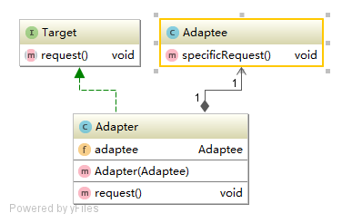
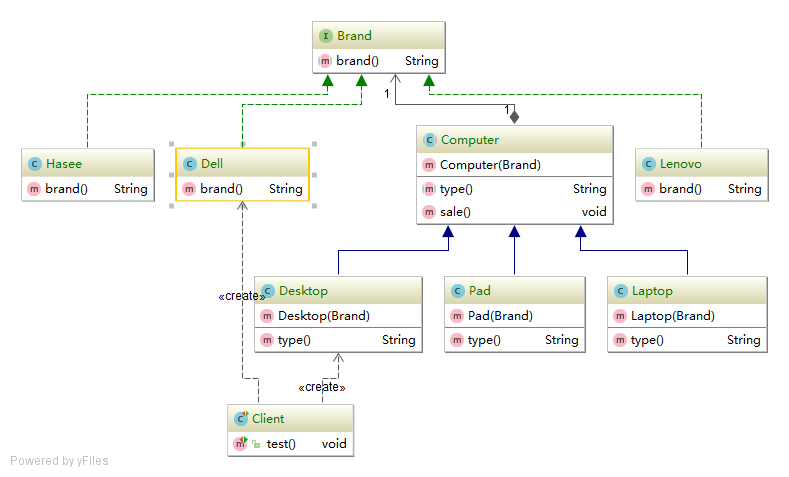
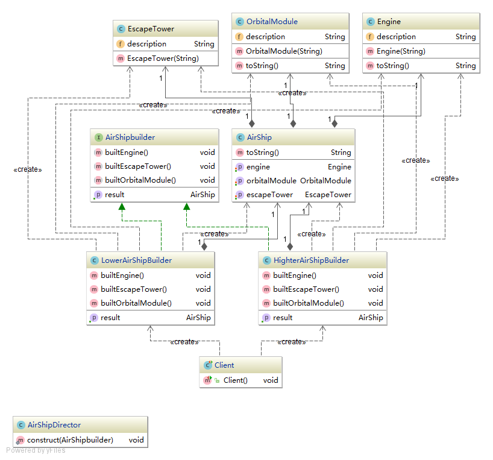
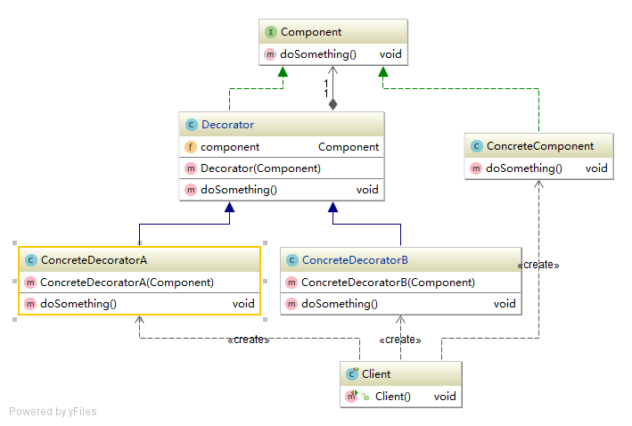
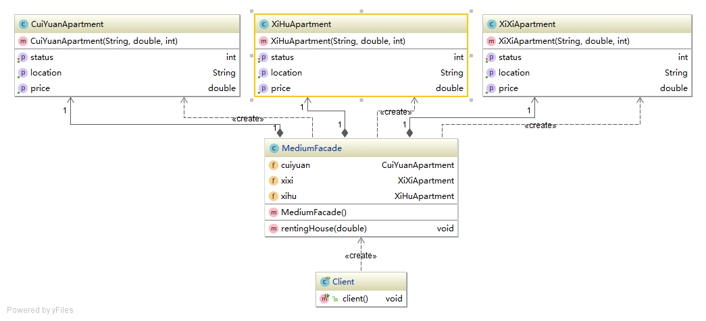
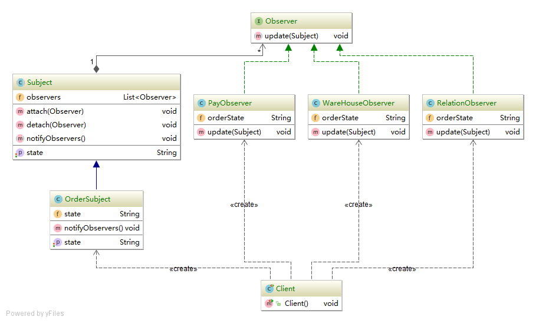
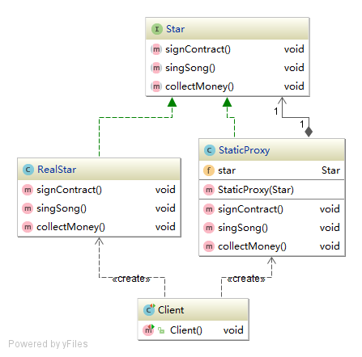
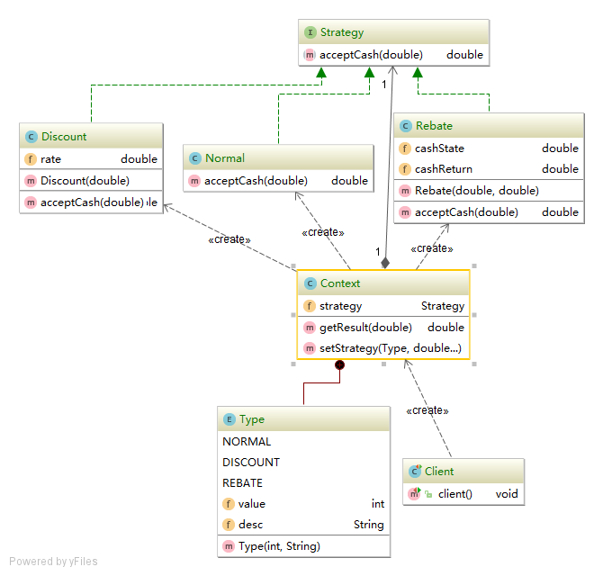

# 设计模式

## 适配器模式

- [适配器模式](src/main/java/adapter/)

## 桥接模式

- [桥接模式](src/main/java/bridge)

## 建造者模式

- [建造者模式](src/main/java/builder)

## 装饰者模式

- [装饰者模式](src/main/java/decorator)

## 外观模式

- [外观模式](src/main/java/facade)

## 观察者模式

`观察者模式`: 又称‘发布-订阅’模式, 定义一种对象间的一对多依赖关系(多个观察者Observer监听某一主题Subject). 当主题状态发生改变时,所有依赖它的对象都得到通知并被自动更新.

核心: 触发联动

### [模式实现](src/main/java/observer)

以电商系统下单:

用户购买某件商品下一个订单, 需要: 通知库存系统减少库存、通知商家系统发货、通知支付系统收钱、甚至还会通知关系中心使当前用户关注该商家.

## 代理模式

- [代理模式](src/main/java/proxy)

## 策略模式

`策略模式`: 定义一系列的算法, 将其一个个封装起来, 并使它们可相互替换, 使得算法可独立于使用它的客户而变化.

策略模式对应于解决某一问题的一个算法族, 允许用户从该算法族中任选一个算法解决该问题, 同时可以方便的更换算法或者增加新的算法. 并由客户端决定调用哪个算法(核心: 分离算法, 选择实现).

### 作用

- 析取算法: Strategy接口为Context定义了一个可重用的算法/行为, 继承/实现其有助于析取出算法族的公共功能, 且可减少算法与Client间的耦合.
- 消除条件语句: 避免将不同行为堆砌在一个类中, 将行为封装在独立的Strategy实现中, 可在Client中消除条件语句.
- 简化单元测试: 每个算法都有自己的类, 可以单独测试.

### 场景

- 当使用一个算法的不同变体, 且这些变体可以实现为一个算法族时;
- 算法的客户不需要知晓其内部数据, 策略模式可以避免暴露复杂的、与算法相关的数据结构;
- 一个类定义了多种行为, 且这些行为以多个条件语句形式出现, 可将相关行为各自的Strategy(如: Servlet-api service()方法).

### 相关模式

Flyweight: Strategy对象经常是很好的轻量级对象.

### [模式实现](src/main/java/strategy)

案例: 商场打折 -策略可以简单分为: 原价购买、满减、返利三种策略:

